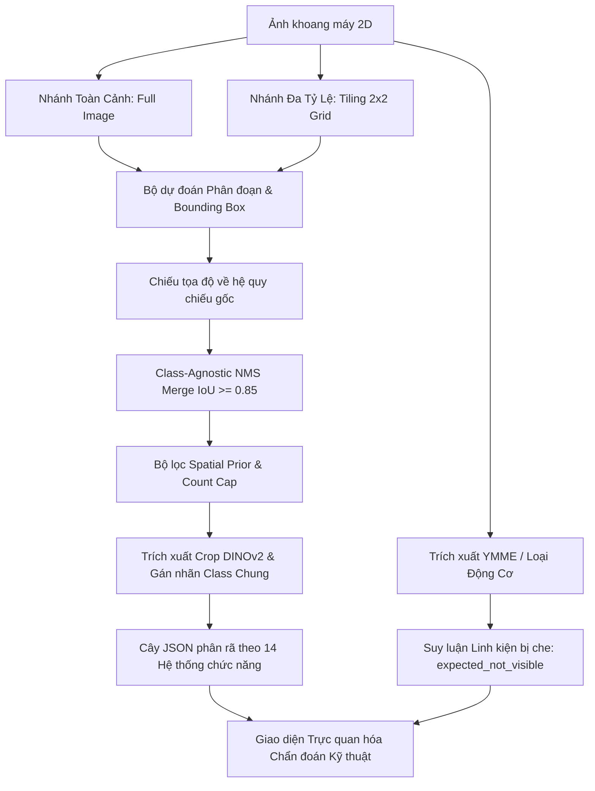

# BẢN MÔ TẢ ĐƠN ĐĂNG KÝ SÁNG CHẾ / GIẢI PHÁP HỮU ÍCH
*(Soạn thảo theo quy chuẩn Cục Sở hữu trí tuệ Việt Nam & Chuẩn mực Hiệp ước Hợp tác Sáng chế PCT)*

---

## 1. TÊN SÁNG CHẾ (TITLE OF THE INVENTION)

* **Tiếng Việt:** **HỆ THỐNG VÀ PHƯƠNG PHÁP NHẬN DIỆN, PHÂN RÃ CHỨC NĂNG PHÂN CẤP VÀ HIỆU CHUẨN ĐỘ TIN CẬY CÁC LINH KIỆN KHOANG ĐỘNG CƠ PHƯƠNG TIỆN SỬ DỤNG THỊ GIÁC MÁY TÍNH ĐA TỶ LỆ**
* **Tiếng Anh:** **METHOD AND SYSTEM FOR HIERARCHICAL FUNCTIONAL DECOMPOSITION AND MULTI-SCALE VISUAL INSPECTION WITH CONFIDENCE CALIBRATION FOR VEHICLE ENGINE BAY COMPONENTS**

---

## 2. LĨNH VỰC KỸ THUẬT ĐƯỢC ĐỀ CẬP (FIELD OF THE INVENTION)

Sáng chế này thuộc lĩnh vực **thị giác máy tính (computer vision), trí tuệ nhân tạo (artificial intelligence) và chẩn đoán kỹ thuật ô tô (automotive diagnostics)**. Cụ thể hơn, sáng chế đề cập đến một hệ thống và phương pháp tự động phân đoạn (semantic segmentation), nhận diện và phân nhóm toàn diện các linh kiện cơ khí, điện tử nhìn thấy được trong khoang động cơ phương tiện giao thông theo các hệ thống chức năng kỹ thuật, kết hợp cơ chế suy luận đa tỷ lệ để tối ưu hóa độ thu hồi (recall) cho linh kiện kích thước nhỏ, và phương pháp hiệu chuẩn độ tin cậy nhãn phục vụ quy trình gán nhãn chủ động (active learning).

---

## 3. TÌNH TRẠNG KỸ THUẬT CỦA SÁNG CHẾ (BACKGROUND / PRIOR ART)

### 3.1. Bối cảnh kỹ thuật
Trong ngành công nghiệp dịch vụ, bảo dưỡng và giám định ô tô (Aftermarket and Technical Inspection), việc kiểm tra khoang động cơ (engine bay) đòi hỏi kỹ thuật viên phải xác định chính xác hàng chục linh kiện cơ khí, cảm biến, van chấp hành, đường ống và hộp điều khiển. Hiện nay, quy trình này chủ yếu dựa vào mắt thường của kỹ thuật viên, dẫn đến tốn thời gian, dễ bỏ sót lỗi và khó đồng bộ hóa dữ liệu kiểm định.

### 3.2. Hạn chế của các giải pháp hiện hữu
1. **Hệ thống thị giác máy tính dây chuyền sản xuất (OEM Vision Systems):** Các giải pháp kiểm tra thị giác trong nhà máy (như của Bosch, BMW) chỉ hoạt động trong buồng sáng cố định, góc quay cố định và chỉ kiểm tra duy nhất một cấu hình động cơ cụ thể đã được lập trình sẵn. Các hệ thống này hoàn toàn mất tác dụng khi áp dụng cho ảnh chụp tự nhiên (bằng điện thoại hoặc tablet) trên hàng trăm dòng xe khác nhau ngoài thị trường với góc chụp, ánh sáng và mức độ bám bẩn đa dạng.
2. **Hệ thống quét xe thương mại (Vehicle Scanners):** Các hệ thống quét tự động hiện tại (như UVeye, Ravin AI, ProovStation) chỉ tập trung quét ngoại thất, bề mặt sơn, lốp xe và gầm xe. Khoang máy bị các hãng này bỏ qua vì độ phức tạp hình thái quá cao, mức độ che khuất lẫn nhau lớn và kích thước linh kiện chênh lệch từ vài milimet (giắc điện, ốc xả) đến hàng chục centimet (nắp động cơ, bầu lọc gió).
3. **Các mô hình nhận diện đối tượng tiêu chuẩn (Standard Object Detectors):**
   * Các mô hình AI thông thường (YOLO, Faster R-CNN, Mask R-CNN) khi áp dụng vào khoang máy chỉ nhận diện được danh sách đóng cố định khoảng 5 đến 10 linh kiện lớn, dễ nhìn (bình ắc quy, nắp nhớt, bình nước làm mát). Khi gặp các linh kiện ít dữ liệu hoặc chi tiết nhỏ, mô hình có tỷ lệ bỏ sót (false negative) rất cao.
   * Khi chụp ảnh toàn cảnh khoang máy ở độ phân giải tiêu chuẩn (ví dụ 640×640 px), các linh kiện nhỏ (cảm biến MAF, van EVAP, giắc cắm) bị nén độ phân giải dẫn đến mất chi tiết đặc trưng (tỷ lệ recall dưới 40%).
   * Chưa có cơ chế phân rã theo hệ thống chức năng và chưa có giải pháp xác định các linh kiện bắt buộc phải có nhưng đang bị che khuất theo loại động cơ (`expected_not_visible`).
   * Điểm tin cậy (confidence score) nguyên bản xuất ra từ các mô hình thị giác hoặc mô hình đa phương thức (Vision-Language Models - VLM) thường bị hiệu chỉnh sai (miscalibrated), dẫn đến việc không thể tự động hóa việc gán nhãn dữ liệu mà không có rủi ro gây nhiễu tập huấn luyện.

Do đó, một nhu cầu cấp thiết đặt ra là phải có một phương pháp và hệ thống kỹ thuật giải quyết triệt để sự cân bằng giữa độ chính xác và độ thu hồi cho mọi linh kiện trong khoang máy, phân loại chúng theo hệ thống chức năng kỹ thuật ô tô, và cung cấp cơ chế tự động thẩm định dữ liệu đáng tin cậy.

---

## 4. BẢN CHẤT KỸ THUẬT CỦA SÁNG CHẾ (SUMMARY OF THE INVENTION)

Mục đích của sáng chế nhằm khắc phục các nhược điểm nêu trên bằng cách cung cấp một phương pháp và hệ thống hoàn chỉnh với 4 giải pháp kỹ thuật cốt lõi:

### 4.1. Cơ chế phân tầng Taxonomy 3 tầng kết hợp Lớp dự phòng (Generic Fallbacks) và Thăng hạng trễ (Hysteresis Promotion)
Xây dựng cây cấu trúc gồm 3 tầng phân cấp:
* **Tầng 1 (Hệ thống chức năng):** Phân chia khoang máy thành 14 hệ thống kỹ thuật chuẩn ô tô (Làm mát, Bôi trơn, Đánh lửa, Nạp khí, Nhiên liệu & EVAP, Điện & Khởi động, Khí xả, Phanh, v.v.).
* **Tầng 2 (Nhóm hình thái/hình dạng):** Nhóm các linh kiện có cùng cấu trúc hình học (ví dụ: nhóm bình chứa - *reservoirs*, nhóm nắp/nút - *caps*, nhóm đường ống - *hoses*, nhóm hộp/mô đun - *module boxes*).
* **Tầng 3 (Linh kiện chi tiết):** 63 linh kiện cụ thể.

Để giải quyết bài toán đuôi dài (long-tail distribution) và linh kiện hiếm mẫu, sáng chế áp dụng quy tắc:
* Thiết lập **6 lớp bao đóng hình dạng chung (Tier C - Generic Fallback Classes)**: `other_reservoir`, `other_sensor_actuator`, `other_hose_line`, `other_cap_plug`, `other_module_box`, `other_pulley_device`. Mọi linh kiện nhìn thấy nhưng chưa đủ mẫu để định danh riêng sẽ được gom vào các lớp chung này để mô hình không bao giờ bỏ sót vật thể.
* **Quy tắc thăng hạng trễ (Promotion Hysteresis):** Một linh kiện chi tiết từ Tier B chỉ được nâng lên thành lớp huấn luyện độc lập (Tier A) khi đạt ngưỡng tối thiểu $\ge 60$ mẫu được thẩm định từ $\ge 8$ phương tiện khác nhau; và chỉ bị hạ cấp xuống lớp chung khi số mẫu giảm xuống dưới 40 mẫu. Điều này đảm bảo tính ổn định tối đa cho không gian đặc trưng của mạng nơ-ron.

### 4.2. Quy trình suy luận đa tỷ lệ kết hợp hậu xử lý theo ràng buộc không gian (Multi-Scale Inference with Spatial Priors)
Để giải quyết bài toán bỏ sót linh kiện nhỏ trong ảnh toàn cảnh, phương pháp suy luận gồm các bước:
1. Đưa ảnh toàn cảnh vào mô hình phân đoạn ở độ phân giải gốc để phát hiện các linh kiện cỡ lớn và trung bình.
2. Tự động phân chia ảnh thành lưới ô $2 \times 2$ có độ chồng lấn (overlap) từ $10\% - 20\%$ và đưa từng ô vào mô hình để phát hiện các linh kiện kích thước nhỏ.
3. Chiếu tọa độ bounding box và mặt nạ (mask) từ các ô con về hệ tọa độ gốc của ảnh.
4. Áp dụng thuật toán **gộp không phân biệt lớp (Class-Agnostic NMS merge)** với ngưỡng giao IoU $\ge 0.85$ để triệt tiêu các dự đoán phân mảnh cùng một vật thể từ các tỷ lệ khác nhau.
5. Áp dụng **bộ lọc ràng buộc không gian và giới hạn số lượng (Spatial Priors & Count Cap)**: Dựa trên phân bố xác suất vị trí không gian theo trục tọa độ chuẩn hóa ($p_{10} - p_{90}$) và số lượng tối đa cho phép trên mỗi phương tiện (ví dụ: chỉ có 1 bình ắc quy, 1 bình dầu phanh, tối đa 4–8 cuộn đánh lửa tùy số xi-lanh) để loại bỏ các dương tính giả (false positives).

### 4.3. Mô hình hiệu chuẩn độ tin cậy từ phán quyết chuyên gia (Verdict-Trained Confidence Calibration)
Phương pháp tự động thẩm định và phân tầng phê duyệt nhãn cho ảnh xe mới thông qua mô hình học máy Gradient Boosting:
* Đầu vào là véc-tơ đặc trưng gồm: Điểm tin cậy của bộ nhận diện gốc, khoảng cách biên độ tương đồng embedding DINOv2 trên vùng ảnh cắt (crop margin similarity), mật độ phân bố vị trí không gian (prior spatial density), tỷ lệ kích thước logarit, và tỷ lệ co giãn (aspect ratio).
* Nhãn mục tiêu được huấn luyện trực tiếp từ lịch sử phê duyệt đúng/sai của kỹ thuật viên ô tô (verdict ground truth) và phân chia nhóm kiểm thử chéo theo phương tiện (Vehicle GroupKFold).
* Tự động phân tầng dữ liệu: Tầng có độ tin cậy $\ge 0.90$ được xác nhận tự động với độ chuẩn xác $\ge 94.1\%$; tầng trung gian được chuyển sang giao diện kiểm duyệt bán tự động, giúp giảm trên $80\%$ công sức thẩm định thủ công.

### 4.4. Cơ chế phân rã chức năng và suy luận linh kiện bị che khuất (`expected_not_visible`)
Dựa trên siêu dữ liệu phương tiện (Năm, Hãng, Kiểu xe, Loại động cơ - YMME) trích xuất từ văn bản trên nắp máy hoặc biển kiểm soát, hệ thống đối chiếu với sơ đồ kiến trúc động cơ để trả về:
1. Cây danh mục các linh kiện nhìn thấy được gom theo hệ thống chức năng.
2. Danh sách các linh kiện cơ khí **chắc chắn tồn tại theo nguyên lý động cơ nhưng hiện đang bị che khuất** (ví dụ: bugi đánh lửa nằm dưới nắp che động cơ, van luân hồi khí xả EGR nằm ở mặt sau vách ngăn máy) để hướng dẫn thợ tháo dỡ kiểm tra khi chẩn đoán mã lỗi DTC.

---

## 5. MÔ TẢ VẮN TẮT CÁC HÌNH VẼ (BRIEF DESCRIPTION OF THE DRAWINGS)

* **Hình 1:** Sơ đồ khối tổng thể cấu trúc hệ thống nhận diện và chẩn đoán khoang động cơ phương tiện.
* **Hình 2:** Sơ đồ cấu trúc phân tầng Taxonomy 3 cấp kết hợp các lớp bao đóng hình dạng dự phòng và cơ chế thăng hạng trễ.
* **Hình 3:** Lưu đồ quy trình suy luận đa tỷ lệ kết hợp chia ô $2 \times 2$, thuật toán gộp không phân biệt lớp (Class-Agnostic Merge) và bộ lọc giới hạn số lượng theo tri thức không gian.
* **Hình 4:** Sơ đồ khối quy trình trích xuất đặc trưng và mô hình Gradient Boosting hiệu chuẩn độ tin cậy nhãn phục vụ học chủ động (Active Learning).
* **Hình 5:** Sơ đồ minh họa giao diện kết quả phân rã linh kiện theo 14 hệ thống chức năng kỹ thuật và danh sách linh kiện bị che khuất.

---

## 6. MÔ TẢ CHI TIẾT SÁNG CHẾ (DETAILED DESCRIPTION)

### 6.1. Thuật toán phân tầng dữ liệu và thăng hạng trễ
Quy trình quản lý dữ liệu linh kiện tuân theo thuật toán sau:
Cho tập hợp các linh kiện chi tiết $C = \{c_1, c_2, ..., c_M\}$. Mỗi linh kiện $c_i$ thuộc về một nhóm hình dạng $G(c_i)$ và một hệ thống chức năng $S(c_i)$.
Số lượng mẫu được thẩm định của linh kiện $c_i$ trên toàn bộ cơ sở dữ liệu là $N(c_i)$, đến từ số lượng phương tiện phân biệt là $V(c_i)$.

Trạng thái huấn luyện $T(c_i)$ được xác định bởi hàm điều kiện có trễ (hysteresis function):
$$T(c_i) = \begin{cases} 
\text{Tier A (Lớp huấn luyện độc lập)}, & \text{nếu } N(c_i) \ge 60 \text{ và } V(c_i) \ge 8 \\
\text{Tier C (Gộp vào lớp } G(c_i)\text{)}, & \text{nếu } T_{\text{cũ}}(c_i) = \text{Tier A và } N(c_i) < 40 \\
\text{Tier C (Gộp vào lớp } G(c_i)\text{)}, & \text{nếu } T_{\text{cũ}}(c_i) = \text{Tier B và chưa đạt ngưỡng Tier A}
\end{cases}$$

Bằng quy tắc này, tập dữ liệu huấn luyện luôn duy trì số lớp tối ưu (ví dụ 27 lớp) gồm 21 lớp Tier A và 6 lớp Tier C, ngăn chặn hiện tượng mất cân bằng dữ liệu cực đoan làm giảm hiệu suất mạng nơ-ron.

### 6.2. Pipeline suy luận đa tỷ lệ kết hợp tri thức không gian
Khi tiếp nhận ảnh đầu vào $I$ kích thước $W \times H$:
1. Ảnh được đưa qua nhánh toàn cảnh để tạo tập dự đoán $P_{\text{full}} = \{(b_k, m_k, s_k, c_k)\}$, trong đó $b_k, m_k, s_k, c_k$ lần lượt là bounding box, mask, score và class.
2. Ảnh $I$ được chia thành 4 ô $T_{ij}$ ($i, j \in \{0, 1\}$) với kích thước:
   $$W_{\text{tile}} = \frac{W}{2} + \delta_W, \quad H_{\text{tile}} = \frac{H}{2} + \delta_H$$
   với $\delta$ là biên độ chồng lấn ($10\% - 20\%$).
3. Tập dự đoán từ các ô $P_{\text{tile}}$ được dịch chuyển tọa độ:
   $$b_{\text{global}} = [x_1 + X_{\text{offset}}, y_1 + Y_{\text{offset}}, x_2 + X_{\text{offset}}, y_2 + Y_{\text{offset}}]$$
4. Gộp hai tập dự đoán $P = P_{\text{full}} \cup P_{\text{tile}}$.
5. Khử trùng lặp đa tỷ lệ: Nếu hai dự đoán $p_a, p_b \in P$ có $\text{IoU}(b_a, b_b) \ge 0.85$, hệ thống giữ lại dự đoán có diện tích mask lớn hơn hoặc điểm tin cậy cao hơn, bất kể nhãn phân loại ban đầu.
6. Áp dụng Count Cap: Với mỗi lớp $c$, nếu số lượng phát hiện $K_c > K_{c, \text{max}}$ (với $K_{c, \text{max}}$ được định nghĩa trước theo cấu hình xe), hệ thống sắp xếp theo điểm $s$ và chỉ giữ lại $K_{c, \text{max}}$ dự đoán cao nhất nằm trong vùng tọa độ phân bố $[p_{10}, p_{90}]$ của lớp đó.

### 6.3. Thuật toán hiệu chuẩn độ tin cậy nhãn phục vụ Active Learning
Để tạo nhãn tự động từ tập ảnh thô mà không làm bẩn dữ liệu:
1. Trích xuất đặc trưng của mỗi đề xuất vùng (bounding box crop $I_{\text{crop}}$):
   * $f_{\text{vlm}}$: Điểm tin cậy từ mô hình ngôn ngữ thị giác.
   * $f_{\text{sim\_claimed}} = \max_{j} \cos(\mathbf{e}_{\text{crop}}, \mathbf{e}_{j}^{\text{claimed}})$: Độ tương đồng cosine giữa embedding DINOv2 của crop với gallery mẫu chuẩn của lớp được gán.
   * $f_{\text{sim\_rejected}} = \max_{k} \cos(\mathbf{e}_{\text{crop}}, \mathbf{e}_{k}^{\text{other}})$: Độ tương đồng lớn nhất với các mẫu của lớp khác.
   * $f_{\text{margin}} = f_{\text{sim\_claimed}} - f_{\text{sim\_rejected}}$.
   * $f_{\text{prior}} = \text{PDF}_{\text{spatial}}(x_{\text{center}}, y_{\text{center}} \mid c)$.
   * $f_{\text{geom}} = [\log(\text{Area}), \text{Aspect Ratio}]$.
2. Véc-tơ đặc trưng $\mathbf{x} = [f_{\text{vlm}}, f_{\text{margin}}, f_{\text{prior}}, f_{\text{geom}}]$ được đưa qua mô hình Gradient Boosting Decision Tree (GBDT) để dự đoán xác suất chính xác $P(\text{correct} \mid \mathbf{x})$.
3. Phân tầng quyết định:
   * Nếu $P(\text{correct} \mid \mathbf{x}) \ge 0.90$: Tự động phê duyệt nhãn đưa vào tập huấn luyện.
   * Nếu $0.40 \le P(\text{correct} \mid \mathbf{x}) < 0.90$: Đưa vào danh sách chờ kỹ thuật viên duyệt nhanh trên giao diện Set-of-Mark.
   * Nếu $P(\text{correct} \mid \mathbf{x}) < 0.40$: Tự động loại bỏ.

---

## 7. KẾT QUẢ THỰC NGHIỆM VÀ HIỆU QUẢ KỸ THUẬT CỦA SÁNG CHẾ

Các số liệu thực nghiệm thu được từ quá trình kiểm thử trên tập dữ liệu khoang máy thực tế chứng minh tính vượt trội:

1. **Hiệu quả thu hồi (Recall) của quy trình suy luận đa tỷ lệ:**
   Kiểm thử trên 125 ảnh kiểm định độc lập của các dòng xe khác nhau (với mô hình nền tảng YOLO11l-seg tại kích thước 640 px):
   * Suy luận ảnh toàn cảnh đơn lẻ: Recall đạt **0.582**, Precision **0.632**.
   * Áp dụng suy luận đa tỷ lệ $2 \times 2$ Tiles + Class-Agnostic Merge + Count Cap: Recall tăng lên **0.614** (đặc biệt: hệ bôi trơn tăng $+7\%$, hệ làm mát tăng $+6\%$, hệ nạp khí tăng $+4\%$, hệ điện tăng $+3\%$).
2. **Hiệu quả của mô hình hiệu chuẩn độ tin cậy nhãn:**
   Kiểm thử trên 4.627 đề xuất vùng đã được chuyên gia thẩm định từ 177 phương tiện giao thông (kiểm định chéo GroupKFold theo xe):
   * Phương pháp thông thường (chỉ dùng điểm tin cậy của mô hình thị giác): AUROC chỉ đạt **0.617**, không thể tự động phê duyệt mẫu nào đạt độ chính xác $\ge 95\%$.
   * Phương pháp của sáng chế: AUROC tăng vọt lên **0.844** (độ phân biệt xuất sắc). Tại ngưỡng điểm $\ge 0.90$, mô hình bao phủ $21.8\%$ tổng số mẫu với độ chính xác đạt **94.1\%**, giúp tự động hóa hoàn toàn hơn $1/5$ khối lượng gán nhãn mà không làm suy giảm chất lượng dữ liệu.

---

## 8. YÊU CẦU BẢO HỘ (PATENT CLAIMS)

### Điểm 1 (Yêu cầu bảo hộ độc lập cho Phương pháp):
Một phương pháp xử lý dữ liệu và nhận diện thị giác máy tính đối với khoang động cơ phương tiện giao thông, phương pháp bao gồm các bước:
1. Tiếp nhận một ảnh chụp hai chiều (2D) của khoang động cơ từ thiết bị thu nhận hình ảnh;
2. Thực hiện suy luận đa tỷ lệ song song trên ảnh chụp thông qua:
   * Một nhánh toàn cảnh xử lý toàn bộ ảnh để trích xuất các đề xuất vùng và mặt nạ phân đoạn cho các linh kiện có kích thước lớn;
   * Một nhánh phân mảnh tự động chia ảnh chụp thành lưới gồm nhiều ô con có độ chồng lấn xác định trước và phóng đại từng ô con để trích xuất các đề xuất vùng cho các linh kiện có kích thước nhỏ;
3. Chiếu tọa độ của các đề xuất vùng từ các ô con về hệ quy chiếu không gian chung của ảnh toàn cảnh;
4. Gộp các đề xuất vùng thông qua thuật toán triệt tiêu không cực đại phi phân loại (Class-Agnostic Non-Maximum Suppression) dựa trên ngưỡng diện tích giao nhau trên diện tích hợp (IoU) xác định trước để triệt tiêu hiện tượng phát hiện trùng lặp của cùng một vật thể qua các tỷ lệ khác nhau;
5. Áp dụng bộ lọc ràng buộc vị trí không gian xác suất và ngưỡng giới hạn số lượng tối đa trên mỗi phương tiện cho từng loại linh kiện để loại bỏ các dương tính giả;
6. Phân nhóm các linh kiện đã được nhận diện thành một cây phân cấp bao gồm danh mục 14 hệ thống kỹ thuật chức năng của phương tiện; và
7. Xuất cấu trúc dữ liệu biểu diễn các linh kiện nhìn thấy kèm theo danh sách các linh kiện bị che khuất dựa trên việc đối chiếu loại động cơ của phương tiện với cơ sở tri thức kỹ thuật.

### Điểm 2 (Yêu cầu bảo hộ phụ thuộc):
Phương pháp theo Điểm 1, trong đó tại Bước (6), hệ thống phân loại linh kiện tuân theo một cơ chế phân tầng dữ liệu 3 cấp gồm: Tầng hệ thống chức năng, Tầng nhóm hình thái hình học, và Tầng linh kiện chi tiết; trong đó các linh kiện chi tiết chưa đủ số lượng mẫu được định danh theo các lớp bao đóng hình dạng dự phòng (Generic Fallback Classes) bao gồm: nhóm bình chứa chung, nhóm van và cảm biến chung, nhóm đường ống chung, nhóm nắp đậy chung, và nhóm hộp điều khiển chung.

### Điểm 3 (Yêu cầu bảo hộ phụ thuộc):
Phương pháp theo Điểm 2, trong đó các linh kiện chi tiết được quản lý bằng cơ chế thăng hạng có độ trễ (Promotion Hysteresis), theo đó một linh kiện chi tiết chỉ được nâng cấp thành một lớp phân loại độc lập khi đạt số lượng mẫu thẩm định tối thiểu từ một số lượng phương tiện phân biệt xác định trước; và chỉ bị giáng cấp về lớp bao đóng hình dạng dự phòng khi số lượng mẫu giảm xuống dưới một ngưỡng sàn thấp hơn ngưỡng nâng cấp.

### Điểm 4 (Yêu cầu bảo hộ phụ thuộc):
Phương pháp theo Điểm 1, trong đó ngưỡng diện tích giao nhau trên diện tích hợp (IoU) của thuật toán triệt tiêu không cực đại phi phân loại tại Bước (4) được thiết lập bằng hoặc lớn hơn $0.85$.

### Điểm 5 (Yêu cầu bảo hộ phụ thuộc):
Phương pháp theo Điểm 1, trong đó bộ lọc ràng buộc vị trí không gian tại Bước (5) sử dụng phân bố xác suất tọa độ từ phân vị thứ 10 ($p_{10}$) đến phân vị thứ 90 ($p_{90}$) được xây dựng từ tập dữ liệu tham chiếu của từng loại linh kiện cụ thể.

### Điểm 6 (Yêu cầu bảo hộ phụ thuộc):
Phương pháp theo Điểm 1, trong đó phương pháp bao gồm thêm quy trình hiệu chuẩn độ tin cậy nhãn tự động phục vụ học chủ động (Active Learning), bao gồm:
* Trích xuất véc-tơ đặc trưng đa chiều từ mỗi đề xuất vùng, bao gồm điểm tin cậy thị giác ban đầu, biên độ tương đồng véc-tơ đặc trưng hình ảnh trích xuất từ mô hình thị giác nền tảng (Foundation Model crop margin similarity), mật độ phân bố vị trí không gian, và tỷ lệ hình học;
* Ước tính xác suất chính xác của đề xuất vùng thông qua một mô hình học máy cây quyết định tăng cường độ dốc (Gradient Boosting Decision Tree) được huấn luyện trên nhãn phán quyết đúng/sai từ chuyên gia; và
* Tự động phê duyệt các đề xuất vùng có xác suất chính xác vượt ngưỡng xác định trước mà không cần sự can thiệp thủ công của con người.

### Điểm 7 (Yêu cầu bảo hộ độc lập cho Hệ thống):
Một hệ thống nhận diện và chẩn đoán linh kiện khoang động cơ phương tiện giao thông, hệ thống bao gồm:
* Một bộ thu nhận hình ảnh được cấu hình để chụp ảnh khoang động cơ phương tiện;
* Một bộ nhớ lưu trữ các chỉ thị chương trình máy tính và cơ sở dữ liệu ràng buộc không gian linh kiện;
* Một hoặc nhiều bộ xử lý được liên kết với bộ nhớ, được cấu hình để thực thi các chỉ thị chương trình nhằm triển khai phương pháp được xác định trong bất kỳ Điểm nào từ Điểm 1 đến Điểm 6; và
* Một giao diện hiển thị đồ họa trực quan hóa cây thành phần linh kiện theo các hệ thống chức năng kỹ thuật và hiển thị cảnh báo vị trí các linh kiện bị che khuất.

### Điểm 8 (Yêu cầu bảo hộ độc lập cho Phương tiện lưu trữ):
Một phương tiện lưu trữ phi tạm thời có thể đọc được bằng máy tính, chứa các lệnh có thể thực thi bởi một bộ xử lý để khiến bộ xử lý thực hiện các bước của phương pháp được xác định trong bất kỳ Điểm nào từ Điểm 1 đến Điểm 6.

---

## 9. TÓM TẮT SÁNG CHẾ (ABSTRACT)

### Tiếng Việt:
Sáng chế đề cập đến một hệ thống và phương pháp tự động nhận diện, phân đoạn và phân rã chức năng các linh kiện khoang động cơ phương tiện giao thông sử dụng thị giác máy tính đa tỷ lệ. Hệ thống tiếp nhận ảnh 2D khoang máy, thực hiện suy luận song song qua nhánh toàn cảnh và nhánh chia ô $2 \times 2$ có độ chồng lấn, sau đó gộp các phát hiện bằng thuật toán Class-Agnostic NMS (IoU $\ge 0.85$) kết hợp bộ lọc ràng buộc vị trí không gian và giới hạn số lượng để tối ưu hóa độ thu hồi (recall) cho linh kiện kích thước nhỏ mà không gây trùng lặp. Dữ liệu được tổ chức theo cây Taxonomy 3 tầng kết hợp các lớp bao đóng hình dạng chung và quy tắc thăng hạng trễ nhằm giải quyết bài toán linh kiện hiếm mẫu. Hệ thống tích hợp mô hình Gradient Boosting hiệu chuẩn độ tin cậy nhãn từ phán quyết chuyên gia (AUROC 0.844) phục vụ gán nhãn tự động, đồng thời trích xuất danh sách linh kiện bị che khuất (`expected_not_visible`) dựa trên loại động cơ để hỗ trợ chẩn đoán và bảo dưỡng kỹ thuật.

### Tiếng Anh:
The present invention relates to a system and method for automated detection, segmentation, and functional decomposition of vehicle engine bay components using multi-scale computer vision. The system receives a 2D engine bay image, performs parallel inference via a full-image branch and an overlapping $2 \times 2$ tiling grid branch, and merges detections using a class-agnostic NMS algorithm (IoU $\ge 0.85$) combined with spatial prior constraints and count caps to maximize recall on small components without generating duplicate false positives. The data is organized in a 3-tier taxonomy featuring generic fallback classes and promotion hysteresis to address long-tail component scarcity. The system incorporates a verdict-trained gradient boosting model for label confidence calibration (AUROC 0.844) to enable automated active learning, and infers expected not-visible components based on engine type to support comprehensive automotive maintenance and diagnostics.
