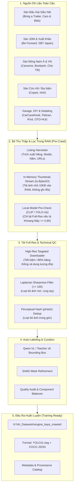

# Hệ Thống Thu Thập Dữ Liệu Khoang Động Cơ Toàn Cầu (Engine Bay Crawl & Curation Engine)

> **Mục tiêu**: Thu thập **5.000 – 15.000 hình ảnh khoang máy ô tô thực tế** từ các nguồn bán xe và đấu giá uy tín trên toàn thế giới, nhằm giải quyết triệt để vấn đề "học thuộc xe" (overfitting trên 19 xe ban đầu) và nâng độ chính xác tổng quát hóa (**Generalization trên xe mới**) cho mô hình YOLO11-seg / Knowledge Distillation.

---

## 1. Bối cảnh & Vấn đề cần giải quyết

Theo kết quả chẩn đoán tại [`../engine_bay_accuracy_roadmap_2026-09-28.md`](../engine_bay_accuracy_roadmap_2026-09-28.md):
- **Hiện trạng v7**: Mô hình đạt mask mAP50-95 **0,72** trên các xe đã học trong tập train, nhưng trên xe mới chưa từng thấy (tập test 3 xe) chỉ đạt **0,25** (khoảng cách mAP lên tới **0,47**).
- **Nguyên nhân cốt lõi**: Không phải do thuật toán hay kích thước mô hình (teacher lớn gấp 10 lần cũng chỉ đạt 0,26 trên test), mà do **sự thiếu hụt trầm trọng về số lượng xe độc lập** (chỉ có 19 xe train). Dù có 1.059 ảnh train, nhưng ~48 ảnh/xe có góc chụp và bố cục quá giống nhau $\rightarrow$ độ đa dạng thực tế chỉ tương đương 19 mẫu.
- **Giải pháp**: Mở rộng từ 19 xe lên **150 – 250 dòng xe độc lập** từ các nguồn bán xe và đấu giá quốc tế/khu vực. Mỗi xe chỉ cần lấy 3–6 ảnh khoang máy ở các góc nhìn chuẩn.

---

## 2. Sơ đồ Kiến Trúc Tổng Thể Pipeline

---

## 3. Cấu Trúc Tài Liệu Kế Hoạch

Folder `docs/plans/crawl_db/` được tổ chức thành 5 tài liệu thành phần chi tiết và 1 giao diện Dashboard tương tác:

| Tệp tài liệu | Nội dung chi tiết |
| :--- | :--- |
| [**01_source_matrix_and_priorities.md**](./01_source_matrix_and_priorities.md) | Ma trận phân tích 44 nguồn dữ liệu, xếp hạng ưu tiên (Tier 1 đến Tier 4 + Tier 1.5 Garage DIY), độ dễ crawl và phân bổ quota dòng xe. |
| [**02_crawler_system_architecture.md**](./02_crawler_system_architecture.md) | Thiết kế kỹ thuật chi tiết của hệ thống crawler: cơ sở dữ liệu SQLite, job queue đa tiến trình, cơ chế xử lý anti-bot (Cloudflare, IP rotation). |
| [**03_filtering_and_qc_pipeline.md**](./03_filtering_and_qc_pipeline.md) | Bộ lọc thông minh & Pre-check in-memory bằng Local Model (CLIP ViT-B/32 / YOLO-cls trên RAM stream `io.BytesIO`), kiểm soát độ mờ và lọc trùng lặp. |
| [**04_annotation_and_integration.md**](./04_annotation_and_integration.md) | Quy trình tích hợp với bộ công cụ auto-labeling SAM2 + Qwen-VL của dự án và chiến lược cân bằng 20 lớp linh kiện. |
| [**05_garage_and_diy_portal_crawling.md**](./05_garage_and_diy_portal_crawling.md) | Chiến lược khai thác chuyên biệt các cổng kỹ thuật ô tô, garage sửa chữa (CarCareKiosk, Pelican Parts, iFixit, OTO-HUI, Hà Thành Garage) nhằm giải quyết dứt điểm các lớp mAP thấp. |
| [**car_engine_bay_sources.html**](./car_engine_bay_sources.html) | **Interactive Web Dashboard**: Tra cứu trực quan 44 sàn xe & garage, mô phỏng tiết kiệm băng thông In-memory filter, xuất CSV/JSON, copy link 1-click. |

---

## 4. Các Chỉ Số Mục Tiêu (Target KPIs)

| Chỉ số | Hiện trạng (v7) | Mục tiêu sau khi bổ sung dữ liệu cào |
| :--- | :---: | :---: |
| **Số lượng xe độc lập** | 19 xe | **150 – 250 xe** (gấp 8–13 lần) |
| **Tổng số ảnh khoang máy chuẩn** | 1.059 ảnh | **4.000 – 6.000 ảnh** đã lọc sạch |
| **Tỷ lệ ảnh rác (ngoại/nội thất)** | — | **< 1%** (qua bộ lọc CLIP) |
| **Khoảng cách mAP train–test** | 0,47 (0,72 train vs 0,25 test) | **< 0,20** (triệt tiêu hiện tượng học thuộc xe) |
| **Test mask mAP50-95 trên xe mới** | 0,249 | **≥ 0,38 – 0,45** |
| **Test mask mAP50 trên xe mới** | 0,44 | **≥ 0,65 – 0,72** |
