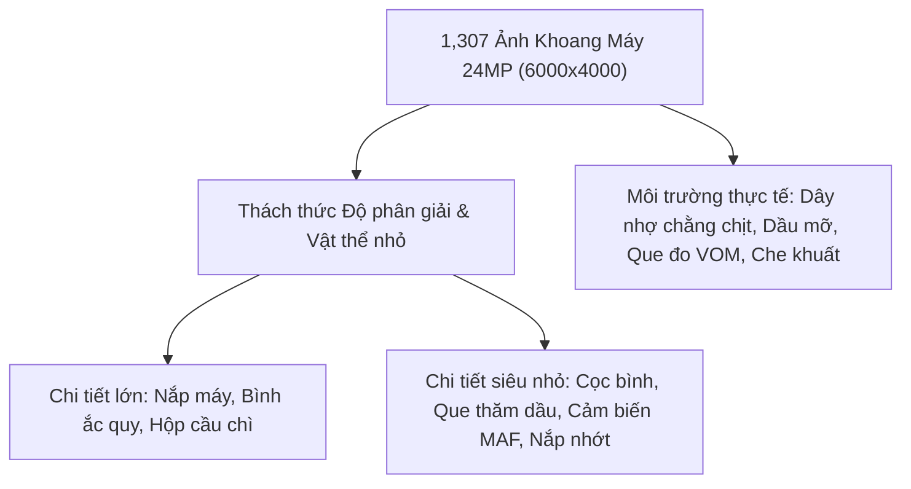
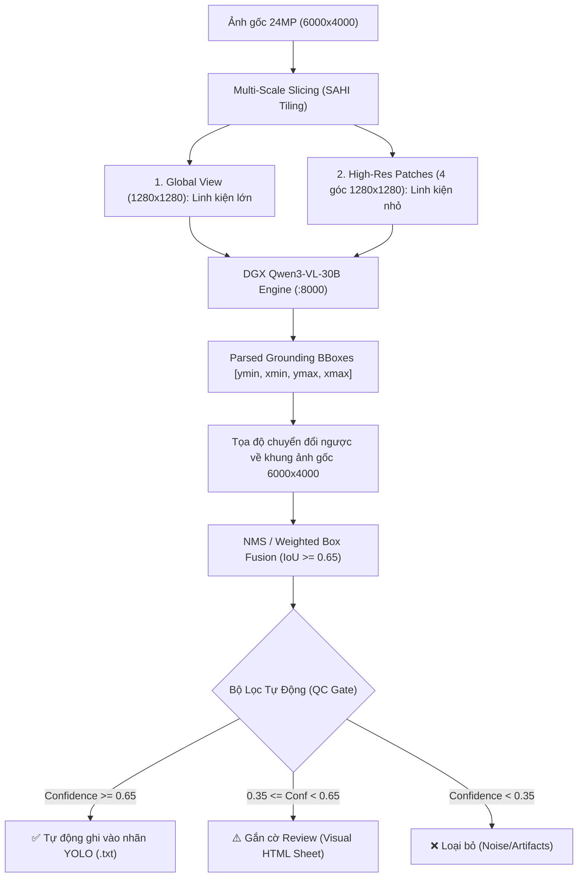

# KẾ HOẠCH TOÀN DIỆN: GÁN NHÃN BOUNDING BOX TỰ ĐỘNG BẰNG VLM QWEN
## DỰ ÁN: NHẬN DIỆN LINH KIỆN KHOANG ĐỘNG CƠ (ENGINE BAY DATASET - 1,307 ẢNH)

---

## 1. BỐI CẢNH VÀ THÁCH THỨC ĐẶC THÙ CỦA TẬP DỮ LIỆU

Tập dữ liệu tại `E:\Research\GEN AI\AI Vision\Distillation\dataset\` bao gồm **1,307 ảnh** độ phân giải cực cao (**$6000 \times 4000$ pixels**, 24 Megapixels) trải dài trên 28 phiên kiểm định (`Request_ID_01` $\rightarrow$ `Request_ID_58`).



### Các Thách Thức Kỹ Thuật:
1. **Mất mát chi tiết khi thu nhỏ ảnh (Downsampling Loss)**: Nếu nén trực tiếp ảnh $6000 \times 4000$ xuống $800 \times 800$, que thăm dầu hoặc cọc bình ắc quy sẽ chỉ còn $2 \times 5$ pixels $\rightarrow$ VLM sẽ bị bỏ sót (False Negative).
2. **Hiện tượng ảo giác (Hallucination)**: VLM có thể tự bịa ra bình ắc quy ở vị trí bị nắp nhựa che khuất hoàn toàn.
3. **Độ chính xác mép hộp (Localization Jitter)**: Cần chuẩn hóa tọa độ hộp bounding box khít sát vật thể theo chuẩn YOLO ($[x_c, y_c, w, h]$ chuẩn hóa $[0, 1]$).

---

## 2. KIẾN TRÚC PIPELINE GÁN NHÃN TỰ ĐỘNG (SYSTEM ARCHITECTURE)



---

## 3. THIẾT KẾ PROMPT KỸ THUẬT & ONTOLOGY (STRUCTURED PROMPT TEMPLATE)

Để VLM Qwen3-VL-30B xuất ra tọa độ chuẩn xác tuyệt đối và hạn chế tối đa ảo giác, ta sử dụng **Structured Two-Phase Prompting**:

### 3.1. Danh mục 20 Linh kiện Mục tiêu (Target Classes):
`0: battery`, `1: battery_terminal`, `2: fuse_relay_box`, `3: coolant_reservoir`, `4: radiator_cap`, `5: brake_fluid_reservoir`, `6: washer_fluid_reservoir`, `7: engine_cover`, `8: oil_filler_cap`, `9: oil_dipstick`, `10: air_filter_box`, `11: air_intake_duct`, `12: maf_sensor`, `13: throttle_body`, `14: alternator`, `15: ignition_coil`, `16: radiator_hose_upper`, `17: serpentine_belt`, `18: ecu_module`, `19: multimeter_diagnostic_tool`.

### 3.2. Mẫu System Prompt Gửi Đến Qwen:

```text
[SYSTEM INSTRUCTION]
You are a master automotive master technician and a certified computer vision annotator specializing in under-hood vehicle inspection.
Your mission is to detect and locate visible engine bay components with precise bounding boxes.

[RULES]:
1. Only locate parts that are ACTUALLY VISIBLE in the image. If a component is completely concealed under a cover, DO NOT predict it.
2. If diagnostic tools (multimeter, test leads, clamps) or technician hands are present, annotate them as "multimeter_diagnostic_tool".
3. Return output strictly in standard Grounding JSON format:
{
  "detections": [
    {
      "class": "battery",
      "bbox_2d": [ymin, xmin, ymax, xmax],
      "confidence": 0.95,
      "description": "12V lead-acid battery located at bottom right"
    }
  ]
}
Coordinates [ymin, xmin, ymax, xmax] must be normalized integers between 0 and 1000.
```

---

## 4. CHIẾN LƯỢC XỬ LÝ ẢNH ĐA TỶ LỆ (SAHI / MULTI-SCALE INFERENCE)

Để không bỏ sót chi tiết nhỏ trên bức ảnh 24MP:

1. **Pass 1 - Toàn cảnh (Global Scale 1280px)**:
   - Thu nhỏ toàn bộ ảnh về $1280 \times 1280$ (giữ nguyên aspect ratio bằng letterboxing).
   - Mục đích: Bắt trọn các linh kiện vĩ mô (`engine_cover`, `battery`, `air_filter_box`, `coolant_reservoir`).
2. **Pass 2 - Lưới cắt cục bộ (Local Patches 4 Quads)**:
   - Cắt ảnh gốc thành 4 khối có độ trùng lặp 20% (overlap):
     - `Top-Left`: Thường chứa bình dầu phanh, nắp nhớt, cổ hút.
     - `Top-Right`: Thường chứa bình nước phụ, hộp lọc gió, cảm biến MAF.
     - `Bottom-Left`: Thường chứa cuộn bô-bin, dây curoa, máy phát điện.
     - `Bottom-Right`: Thường chứa ắc quy, hộp cầu chì, que đo VOM.
   - Resize từng khối về $1024 \times 1024$ gửi lên Qwen.
3. **Hợp nhất tọa độ (Coordinate Mapping & NMS)**:
   - Ánh xạ tọa độ từ 4 khối con về tọa độ gốc $6000 \times 4000$.
   - Sử dụng **Weighted Box Fusion (WBF)** với IoU threshold = $0.65$ để gộp các hộp trùng nhau giữa Pass 1 và Pass 2, giữ lại box khít nhất với confidence cao nhất.

---

## 5. KẾ HOẠCH TRIỂN KHAI 4 GIAI ĐOẠN (IMPLEMENTATION PHASES)

### Giai đoạn 1: Chuẩn bị Script & Tối Ưu Tốc Độ Gọi DGX (Ngày 1)
- [ ] Xây dựng module `scripts/data_pipeline/qwen_grounding_annotator.py`.
- [ ] Áp dụng **Async HTTP Client (`aiohttp`)** kết nối tới DGX Qwen3-VL (`http://dgx-host:8000/v1`).
- [ ] Thiết lập chạy song song **8 concurrent requests** (tốc độ xử lý: ~3 ảnh/giây $\rightarrow$ toàn bộ 1,307 ảnh chỉ mất khoảng **10-15 phút**).

### Giai đoạn 2: Thực Thi Gán Nhãn Toàn Diện (Ngày 2)
- [ ] Chạy pipeline gán nhãn trên 28 thư mục `Request_ID_*`.
- [ ] Tự động ghi 2 định dạng song song:
  - File JSON gốc chứa metadata: `data/car_parts_dataset/raw_annotations/{image_name}.json`.
  - File TXT định dạng chuẩn YOLO Bounding Box: `data/car_parts_dataset/labels/{train,val,test}/{image_name}.txt`.

### Giai đoạn 3: Kiểm Soát Chất Lượng Tự Động (Automated QA/QC) (Ngày 3)
- [ ] Viết script `scripts/data_pipeline/qc_visualizer.py`:
  - Tự động vẽ các Bounding Box màu viền lên 100 ảnh mẫu ngẫu nhiên.
  - Tạo trang web tĩnh `qc_report.html` hiển thị toàn bộ 100 ảnh mẫu để bạn có thể lướt qua trong 3 phút và nghiệm thu chất lượng nhãn.
- [ ] Lọc bỏ các box có tỷ lệ diện tích quá nhỏ ($< 0.05\%$) hoặc quá lớn ($> 95\%$) do lỗi VLM.

### Giai đoạn 4: Tích Hợp Vào Huấn Luyện Distillation (Ngày 4)
- [ ] Cập nhật tập nhãn hoàn thiện vào [configs/data_engine_bay.yaml](file:///e:/Research/GEN%20AI/AI%20Vision/Distillation/configs/data_engine_bay.yaml).
- [ ] Kích hoạt huấn luyện mô hình YOLO-seg với tập nhãn Bounding Box chất lượng cao:
  ```powershell
  python run_auto_pipeline.py --train-engine --epochs 50 --batch-size 16 --device 0
  ```

---

## 6. LỆNH THỰC THI CHUẨN BỊ TRIỂN KHAI

Khi kế hoạch này được bạn phê duyệt, chúng ta sẽ bắt đầu chạy các lệnh:

```powershell
# 1. Kích hoạt pipeline gán nhãn tự động với Qwen3-VL trên DGX:
python scripts/data_pipeline/qwen_grounding_annotator.py --dataset ./dataset --output ./data/car_parts_dataset --workers 8 --enable-sahi

# 2. Sinh báo cáo kiểm định chất lượng trực quan (QC HTML Report):
python scripts/data_pipeline/qc_visualizer.py --images ./data/car_parts_dataset/images/train --labels ./data/car_parts_dataset/labels/train --num-samples 60

# 3. Kích hoạt huấn luyện sau khi nghiệm thu nhãn:
python run_auto_pipeline.py --train-engine --epochs 50 --batch-size 16 --device 0
```
